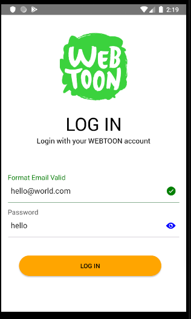
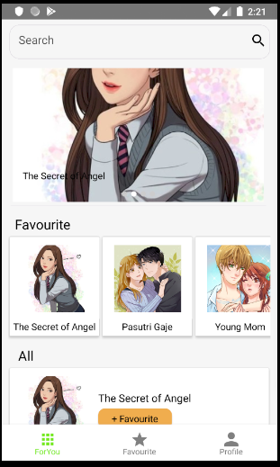
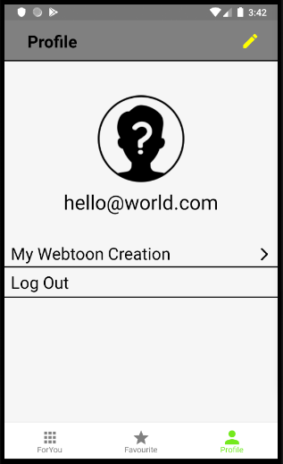
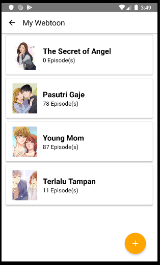
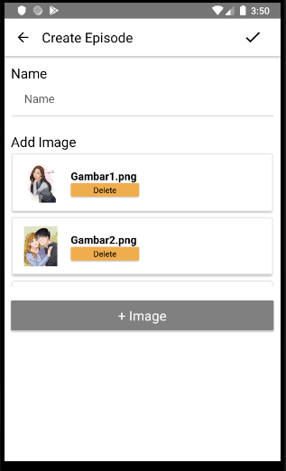

# Webtoon Clone
---

## WebtoonCloneApp
  - <h5>Webtoon Is Most Popular Comic App On Android and IOS.</h5>

---
 <h5>Comming soon with another feature!</h5>

- Let's Look at The Screenshot
  
<p float="left">
  
  
  
  
  
  
  
  
</p>


## Stack
- Using React Native for the Mobile Frontend
- Native Base for UI Library
- React Navigation for Navigation
- React Native Image Picker

## Prerequisites
* Make sure You had been install NodeJs in your system https://nodejs.org/
* Then install React Native https://facebook.github.io/react-native/


**Installation:**

```bash
$ git clone https://github.com/DumbWaysStudent/DW12STM3F_webtoon/tree/master
$ cd DW12STM3F_webtoon/
$ yarn install
$ yarn ios #for ios
$ yarn android #for android
```

## Buy me a Coffee :coffee: [@zzcomzz](https://github.com/zzcomzz)

* For contact : 
  * Telegram : [zzcomzz](t.me/github_add_zzcomzz)


### License
see [zzCOMzz License](LICENSE)
<p>
</p>